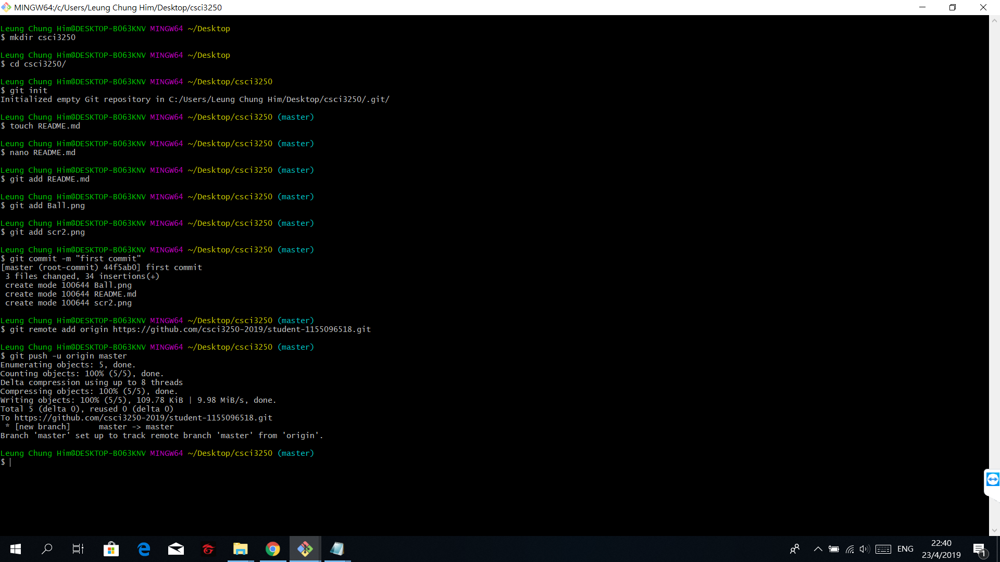
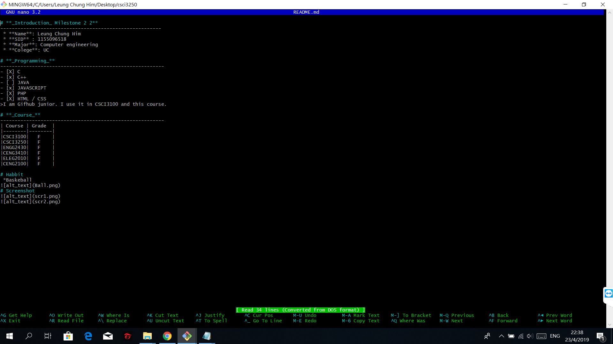

# **_Introduction_ Milestone 2**
--------------------------------------------------------
 * **Name**: Leung Chung Him
 * **SID** : 1155096518
 * **Major**: Computer engineering
 * **College**: UC  

# **_Programming_**
---------------------------------------------------------
- [X] C
- [x] C++
- [ ] JAVA
- [x] JAVASCRIPT
- [X] PHP
- [X] HTML / CSS
- [X] MySQL
- [ ] Python
>I am Gifhub junior. I use it in CSCI3100 and this course.   

# **_Course_**
---------------------------------------------------------
| Course | Grade  |
|--------|--------|
|CSCI3100|   F    |
|CSCI3250|   F    |
|ENGG2430|   F    |
|CENG3410|   F    |
|ELEG2010|   F    |
|CENG2100|   F    |   

# Habbit
 *Baskeball

# Screenshot

